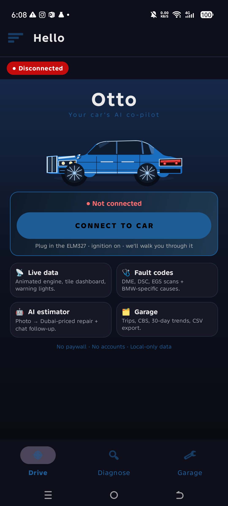

# Otto — BMW OBD2 Diagnostics

<p align="center">
  
</p>

Android app for real-time vehicle diagnostics over a Bluetooth ELM327 adapter.
Built and tuned for the BMW E65 730li (N52) but works with any OBD-II vehicle
that speaks ISO 15765-4 CAN. Includes AI-assisted repair estimation with
follow-up chat grounded in live web search.

Package: `app.otto.car`  ·  Min SDK: 24 (Android 7.0)  ·  Target SDK: 36
Language: Java, no Compose. One small Kotlin file (`CarHeroSceneView.kt`)
is required by the SceneView 3D renderer on the welcome screen; everything
else is Java.

---

## What's inside

- **Live dashboard** with hero RPM/Speed gauges, animated warning lights, and
  BMW-specific module status. Value changes tween 200 ms for a real
  instrument-cluster feel; last-known values seed the gauges on entry so the
  screen never sits blank waiting for the first sample.
- **Guided connect flow** — Bluetooth → OBD adapter → ELM handshake → Vehicle
  ECU, each step with a live status dot. Auto-advances when prerequisites
  already pass. Handles: BT off, permission missing, no paired adapter, paired
  but out of range, adapter linked but ECU silent (ignition off).
- **BMW module scans** — DME, DSC, EGS via UDS `19 02 FF` on `0x6F1`, with
  Mode 22 DIDs for the numbers cluster stores but Mode 01 hides. The
  fuel-level probe walks its candidate DME DIDs in a **single paused,
  D-CAN-routed session** (`ObdManagerFast.readUdsRawBatch`) instead of one
  routing flip per DID, so a probe no longer thrashes the poll loop or leaves
  the dashboard on `NO DATA` while functional addressing settles back.
- **AI Repair Estimator** — snap a photo of a broken part, get a full Dubai-
  priced (AED) repair handout: OEM part numbers, DIY steps, safety warnings,
  workshop query. Powered by Gemini 2.5 Flash Vision.
- **AI chat follow-up** (new) — after any estimate, ask questions like
  "where can I buy this in Deira?" and get answers grounded in a live Google
  Search. Sources are cited and tappable.
- **Simulator mode** — spin up an in-process fake ELM327 that answers every
  standard PID with time-varying values. Whole app runs without a car; used
  for dev, demos and the built-in self-test.
- **Self-test** — connects to the simulator, walks the poll loop for 12 s and
  verifies every dashboard PID delivered a plausible value. Result written
  to `obd-diag.log` with `SELFTEST RESULT PASS|FAIL`.
- **Clear Data** — one-tap wipe of diag logs, crash reports, cached values
  and trend samples. Vehicle profile and Bluetooth pairing are left intact.
- **Reset Bluetooth Pairing** — one-tap unbond of the saved adapter + open
  system BT settings so the user can re-pair without wrestling the phone.

---

## Quick start

```bash
git clone https://github.com/ziacto/otto.git
cd otto
./gradlew :app:assembleDebug
adb install -r app/build/outputs/apk/debug/app-debug.apk
adb shell am start -n app.otto.car/com.example.obd.MainActivity
```

The OBD diagnostics + simulator + self-test all work out of the box.

> ### ⚠️ AI features need your own Gemini key
>
> The **AI Repair Estimator** (photo → structured repair estimate) and the
> **AI chat follow-up** (Google Search-grounded questions) are disabled until
> you provide a Gemini API key. Without one, everything else runs normally
> and those two screens show "AI unavailable".
>
> 1. Grab a free key at https://aistudio.google.com/apikey (Google account,
>    no billing needed — the free tier covers ~1500 requests/day).
> 2. Add one line to `local.properties` at the project root:
>    ```properties
>    AI_KEY=AIza…YOUR_KEY_HERE
>    ```
> 3. Rebuild. Done.
>
> `local.properties` is git-ignored by default, so your key stays local. See
> [AI setup](#ai-setup) for what happens under the hood and the security
> caveat about shipping keys inside APKs.

---

## Architecture

```
MainActivity
 ├── ObdApp               — Application: bootstraps ObdLogger + CrashHandler
 ├── ObdService           — Foreground service running the 30 s reconnect watchdog
 ├── ObdManagerFast       — Poll thread + one-shot commands + module scans
 │    └── ObdConnection   — Transport-agnostic: Bluetooth SPP / GATT / Simulator
 │         ├── BleObdTransport         — GATT (FFF0/FFF1/FFF2) for vLinker BM+
 │         └── SimulatedObdTransport   — piped fake ELM327 for dry-run testing
 ├── Controllers          — One per screen; attach(view) / detach() lifecycle
 │    ├── ConnectFlowController        — guided BT + connect wizard
 │    ├── DashboardController          — hero gauges + tile grid + tweens
 │    ├── GaugeDashboardController     — analogue-style gauge screen
 │    ├── HudDashboardController       — HUD projection layout
 │    ├── FaultCodesController         — Mode 03/04/07/0A + BMW module reads
 │    ├── SensorsController            — per-PID drill-down
 │    ├── GarageController             — CBS, trips, 30-day trends
 │    ├── LiveDataBrowserController    — live data grouped by system
 │    ├── ServiceFunctionsController   — CBS reset, battery reg, sniffer
 │    ├── AnalyticsController          — recording + chart
 │    ├── SprintController             — 0-100 timer
 │    ├── ScanReportsController        — saved reports history
 │    ├── OdometerController           — trip / total distance
 │    ├── KnowledgeBaseController      — BMW-specific reference articles
 │    ├── AiEstimatorController        — photo → estimate → chat
 │    ├── CarAdvisorController         — AI "what car should I buy" chat
 │    └── DebugLogController           — pull ObdLogger to screen
 ├── AI stack
 │    ├── AiVisionProvider         — interface: analyzeDamage + chatFollowup
 │    ├── GeminiVisionProvider     — Gemini 2.5 Flash REST client
 │    └── AiSettings               — API key resolver + per-device quota
 └── Utilities
      ├── ObdLogger                — ring buffer + rotating file sink
      ├── CrashHandler             — dumps stacktrace + recent logs on crash
      ├── LastValuesCache          — persistent last-known sensor values
      ├── TrendEngine              — 30-day sample storage + battery forecast
      ├── DataLogger               — in-memory time series for chart screens
      ├── RawFrameLogger           — every byte in/out of the ELM (opt-in)
      ├── SelfTestRunner           — headless QA against SimulatedObdTransport
      └── AppDataCleaner           — one-shot wipe used by Clear Data action
```

**Threading model.** The UI runs on the main thread. `ObdManagerFast` owns
one `ObdPollThread` at MIN_PRIORITY that walks the current `PollGroup` list.
Every one-shot command (DTC read, VIN, module scan) pauses the poll thread
inside a `synchronized` block on the manager, does its work, then restarts
polling. The Gemini network calls run on plain `Thread`s off the main looper
and post their results back via a `Handler` on the UI looper.

---

## Establishing a connection

1. Plug the OBD2 adapter into the vehicle's diagnostic socket.
2. Turn the ignition to position II (dash lights on, no engine crank needed).
3. Pair the adapter in the system Bluetooth menu — PIN is usually `1234`.
4. Open Otto → tap **Connect to Car** (Welcome) or the red pill in the top
   bar → follow the guided flow.

If the adapter gets stuck ("read failed, socket might closed or timeout"),
drawer → **Reset Bluetooth Pairing**. That unbonds the adapter, forgets the
saved MAC, and drops you into system BT settings to pair fresh.

Auto-connect (on launch) and the guided connect flow can both fire at once.
`ObdManagerFast.connect()` no-ops a duplicate connect to a device it's already
linked to — so the freshly-opened socket isn't torn down and re-initialised a
second time (no double ELM327 handshake / double poll loop in the diag log).

---

## Poll groups

The dashboard uses one of eleven poll groups depending on the screen. Each
group is a list of `ObdCommand` instances with an interval in ms. Screens
that swap dashboards call `ObdManagerFast.swapPollGroup()` which interrupts
the poll sleep so the new group takes effect on the next cycle (no thread
join, no visible pause).

That interrupt can land mid-command. The poll loop recognises its own swap
signal (an `Interrupted` on the in-flight read while `running` is still true),
drops the half-finished cycle **without** flagging those PIDs as failures and
**without** counting it toward the three-empty-cycle disconnect, then re-polls
the new group immediately. A screen switch therefore no longer spams
`Poll FAIL … Interrupted` in the log or risks a spurious "adapter not
responding" teardown.

| Group                | Interval | Commands |
|----------------------|----------|----------|
| GROUP_DASHBOARD      | 500 ms   | 11 (RPM, speed, coolant, oil, throttle, load, battery, fuel, MAF, IAT, MIL) |
| GROUP_HUD_DASHBOARD  | 700 ms   | 17 (dashboard + timing, torque, lambda, fuel trims, ambient) |
| GROUP_LIVE_POWERTRAIN| 700 ms   | 9 |
| GROUP_LIVE_THERMAL   | 1500 ms  | 5 |
| GROUP_LIVE_FUEL      | 1000 ms  | 9 |
| GROUP_LIVE_ELECTRICAL| 2000 ms  | 3 |
| GROUP_LIVE_PERFORMANCE|1000 ms  | 8 |
| GROUP_LIVE_EMISSIONS | 2000 ms  | 4 |
| GROUP_ANALYTICS      | 1000 ms  | 10 |
| GROUP_SPRINT         | 200 ms   | 1 (speed only, for the 0-100 timer) |

### PID reference

| Sensor | PID | Formula | Unit |
|---|---|---|---|
| RPM | 010C | `(256A+B)/4` | 1/min |
| Vehicle Speed | 010D | `A` | km/h |
| Coolant Temp | 0105 | `A-40` | °C |
| Oil Temp | 015C | `A-40` | °C |
| Intake Air Temp | 010F | `A-40` | °C |
| Ambient Temp | 0146 | `A-40` | °C |
| Charge Air Temp | 011F | `A-40` | °C |
| Throttle | 0111 | `100A/255` | % |
| Rel. Throttle | 0145 | `100A/255` | % |
| Accel Pedal | 0149 | `100A/255` | % |
| Engine Load | 0104 | `100A/255` | % |
| Fuel Level | 012F | `100A/255` | % |
| MAF | 0110 | `(256A+B)/100` | g/s |
| Boost | 010B | `A` | kPa |
| Barometric | 0133 | `A` | kPa |
| Fuel Pressure | 010A | `3A` | kPa |
| Timing Advance | 010E | `A/2 - 64` | ° BTDC |
| Injection Timing | 015D | `(256A+B)/128 - 210` | ° |
| Fuel Consumption | 015E | `(256A+B)/20` | L/h |
| Short Term Fuel Trim | 0106 | `100(A-128)/128` | % |
| Long Term Fuel Trim | 0107 | `100(A-128)/128` | % |
| Lambda | 0134 | `2(256A+B)/65536` | λ |
| Commanded Lambda | 0144 | `2(256A+B)/65536` | λ |
| O2 Voltage | 0114 | `A/200` | V |
| Battery Voltage | ATRV | direct read | V |
| Control Module V | 0142 | `(256A+B)/1000` | V |
| Engine Run Time | 011F | `256A+B` | s |
| Actual Torque | 0162 | `A-125` | % |
| Driver Demand Torque | 0161 | `A-125` | % |
| MIL / Readiness | 0101 | see `ObdUtil.parseReadiness` | packed |

### NRC filter

Not every ECU supports every PID. Cheap phones with cheap adapters were
happily rendering `Coolant = -22°C` because the parser was reading the
negative-response code (`7F 01 12` = "service 01 not supported") as raw
data. Byte `0x12` = 18 = coolant formula 18 - 40 = -22.

`ObdCommand.run` now isolates the `<mode+0x40> <pid>` positive-response
slice from the raw ELM buffer before passing it to `parseResult`. If no
positive-response marker is present, the command throws `ELM: NO DATA` and
the poll loop silently skips it. After `UNSUPPORTED_STREAK` (4) consecutive
NO-DATA responses in the same session, the command is marked
`isKnownUnsupported()` and the poll loop skips it entirely — trims cycle
time from ~2.7 s to ~450 ms on a BMW E65 (which only answers PIDs
`01/0C/0D` over standard Mode 01).

Support flags reset on the next `ObdManagerFast.connect()` so a swap
between vehicles re-probes every PID.

---

## Simulator mode (dry-run testing)

For dev, demos and the built-in self-test, drawer → **Simulator Mode (no car
needed)** installs `SimulatedObdTransport` in place of the Bluetooth socket.
The simulator answers every standard PID with values that ramp over a
60-second cycle:

- RPM: 780 → 3600 (cosine sweep)
- Speed: 0 → 90 km/h over the middle 70 %
- Coolant: 60 → 92 °C warmup then oscillates
- Throttle / load: sinusoidal
- Battery: 14.1 V ± 0.15
- Timing, torque, lambda, fuel trims all reasonable

Unknown PIDs return `7F 01 12` so the NRC-filter path gets exercised too.

Can also be launched headlessly:

```bash
adb shell am start -n app.otto.car/com.example.obd.MainActivity \
    --es action simulator
```

---

## Self-test

Drawer → **Run Self-Test** or via ADB:

```bash
adb shell am start -n app.otto.car/com.example.obd.MainActivity \
    --es action selftest
```

The test connects to the simulator, runs `GROUP_DASHBOARD` for 12 seconds,
counts how many samples each PID delivered, and checks every value is
inside a plausible range (e.g. coolant in `[-40, 215]`). Result lands in
`obd-diag.log` as `SELFTEST RESULT PASS` or `FAIL` with a per-PID breakdown.

Grep for the result:

```bash
adb pull /storage/emulated/0/Android/data/app.otto.car/files/obd-diag.log \
    /tmp/otto.log
grep "SELFTEST RESULT" /tmp/otto.log
```

---

## AI setup

Otto uses Google's Gemini 2.5 Flash for both photo analysis and chat.

### Configuring the API key

Grab a free Gemini key at https://aistudio.google.com/apikey (Google account,
no billing setup needed), then drop it into `local.properties` at the project
root:

```properties
AI_KEY=AIza…YOUR_KEY_HERE
```

Rebuild. That's it — `app/build.gradle.kts` injects the value into
`BuildConfig.AI_KEY` at compile time and `AiSettings.getEffectiveKey` reads
it. Fresh clones with no key set still compile cleanly; AI calls just return
null and the UI shows "AI unavailable" until you plug in a key.

`local.properties` is git-ignored by every Android project by default, so
there's zero risk of accidentally committing the key. If you want to ship a
release APK with the key baked in, the same build path applies — the key is
compiled into the APK's `BuildConfig` class.

**Security caveat**: anything embedded in an APK can be recovered by a
reverse engineer. The real protection against runaway billing is Google's
per-project daily quota (1500 requests/day on free tier) plus your own
monitoring. Long-term the correct fix is a backend proxy (Cloudflare Worker
or Firebase Function) that holds the key server-side and rate-limits per
device — see `memory/project_ai_estimator.md` for the migration plan.

### Photo analysis

`AiEstimatorController` → pick photo → **Analyze**. The prompt in
`GeminiVisionProvider.PROMPT_TEMPLATE` requests strict JSON with a schema
covering: identified part, confidence, severity, difficulty, time-to-fix,
parts (OEM number, price range in AED), tools, repair steps, safety warnings,
diagram / manual search queries, related inspections, delayed-fix
consequences, totals (indie / dealer), resale impact.

Response mode is forced to `application/json`, thinking budget is 0 (this is
a template-fill task, no chain-of-thought needed).

### Chat follow-up

After an estimate renders, the chat card unhides. Each question sends:

1. A system-role turn with the persona brief + the raw estimate JSON + the
   original photo bytes (Gemini requires the image be re-sent for every
   generation — no server-side memory).
2. A primed `model` turn so history alternation stays valid.
3. The prior chat history (user/model interleaved).
4. The new user question.

The `tools` array includes `google_search`, which lets Gemini fetch fresh
info when it needs a current price, TSB, or supplier list. Grounding chunks
come back in `candidates[0].groundingMetadata.groundingChunks[].web.uri`;
the controller extracts them and renders tappable "Sources" links beneath
the assistant bubble.

Test the chat end-to-end without the UI:

```bash
adb shell am start -n app.otto.car/com.example.obd.MainActivity \
    --es action ai_chat_test \
    --es q "How much for a genuine BMW E65 water pump in Al Quoz?"
```

The full reply + source URLs land in `obd-diag.log`.

---

## Data storage

Otto persists locally only — no accounts, no analytics, no cloud sync.

| What | Where | Cleared by |
|---|---|---|
| Diag log + rotations | `files/obd-diag.log{,.1,.2}` (external files dir) | Clear Data |
| Crash reports | `files/obd-crash-*.log` | Clear Data |
| Last-known sensor values | `SharedPreferences: obd_last_values` | Clear Data |
| 30-day trend samples | Room DB `pid_sample` table | Clear Data |
| Vehicle profile (VIN, model) | Room DB `vin_profile` table | **NOT** by Clear Data |
| Saved OBD adapter MAC | `SharedPreferences: obd_prefs` | **NOT** by Clear Data — Reset Bluetooth Pairing wipes this |
| Scan reports (DTC, AI estimate) | Room DB `scan_report` table | swipe-to-delete in Scan Reports |
| CBS + service items | Room DB `service_item` table | per-item delete |

Room database name: `otto.db`. See `com.example.obd.db.AppDatabase` and
`Daos.java` for schema.

---

## Logs

`ObdLogger` keeps a 250-entry in-memory ring + writes every entry to
`obd-diag.log` with two-tier rotation (`.1` = prev session, `.2` = older).
Max on-disk footprint: ~1.5 MB. Log lines look like:

```
2026-07-01 17:13:35.302  [INFO]  AI_CHAT_TEST reply (373 chars, 6 sources):
2026-07-01 17:13:35.303  [INFO]  You can expect an OEM BMW E65 N52 water pump...
```

`CrashHandler` intercepts uncaught exceptions and dumps them to
`obd-crash-<timestamp>.log` alongside the last N `ObdLogger` entries, so
post-mortem debugging on a customer phone is just an `adb pull` away.

Pull everything:

```bash
adb pull /storage/emulated/0/Android/data/app.otto.car/files/ /tmp/otto-logs/
```

---

## Debug intent hooks

`MainActivity.onCreate` reads the `action` string extra and, if set, kicks
off the requested task. Useful for scripted QA and automated soak testing:

| Extra              | Effect |
|--------------------|--------|
| `simulator`        | Connects to the simulator transport in the background. |
| `selftest`         | Runs `SelfTestRunner`, writes `SELFTEST RESULT PASS/FAIL` to the log. |
| `ai_chat_test`     | Sends a canned estimate + a chat question, logs the reply + sources. Override the question with `--es q "…"`. |

Combine with `adb shell input keyevent`, `screencap`, and `adb pull` to
build any headless soak test you want without a physical adapter.

---

## Build

```bash
./gradlew :app:assembleDebug           # debug APK
./gradlew :app:compileDebugJavaWithJavac   # fast compile check
./gradlew :app:assembleRelease         # release APK (needs signing config)
```

The project uses Kotlin DSL (`build.gradle.kts`) at the module level and is
Java apart from a single Kotlin file (`CarHeroSceneView.kt`) that the SceneView
3D renderer requires. Room's annotation processor runs via `annotationProcessor`
(no kapt).

### Version compatibility

- Gradle: whatever the wrapper ships with (`./gradlew --version`)
- AGP: 8.x
- Java target: 11
- compileSdk / targetSdk: 36
- minSdk: 24

---

## Roadmap

Ordered by expected user impact:

1. **Compose migration for the dashboard.** Would remove the manual
   `ValueAnimator` per-tile plumbing and let us render seeded values in the
   same frame as the composition. Roughly 3-4 days.
2. **Firebase / Cloudflare AI proxy** to move the Gemini key out of the APK.
   Roughly 2 days.
3. **BMW Mode 22 DID library.** DIDs for coolant, oil, transmission fluid,
   battery IBS state — this is what real BMW cluster shows and what the E65
   DME won't expose over Mode 01.
4. **Auto BLE scan** in the connect flow when no bonded adapter is found.
   Currently falls through to system BT settings.
5. **CarPlay-style HUD projection** via Android Auto integration.

See `memory/project_roadmap.md` for the full 12-feature list.

---

## Known limitations

- Not every vehicle supports every PID. Otto surfaces this as `NO DATA` and
  hides the sensor after four failed cycles (see [NRC filter](#nrc-filter)).
- With a poor Bluetooth connection, values briefly drop out. The pill in the
  status bar goes amber ("Reconnecting…") and green again once frames flow.
- Trip and analytics data are not synced across devices — local only.
- AI answers may cite sources that require login (paid workshops manuals,
  etc.). Otto surfaces the URL; opening it is up to the user's browser.
- The Gemini key is compiled into `BuildConfig` from `local.properties` at
  build time. If you ship a release APK with a key baked in, it can be
  recovered by anyone who reverse-engineers the APK — the real protection is
  Google's per-project daily quota plus the backend-proxy migration on the
  roadmap. Do not use this app as a template for anything security-sensitive.
